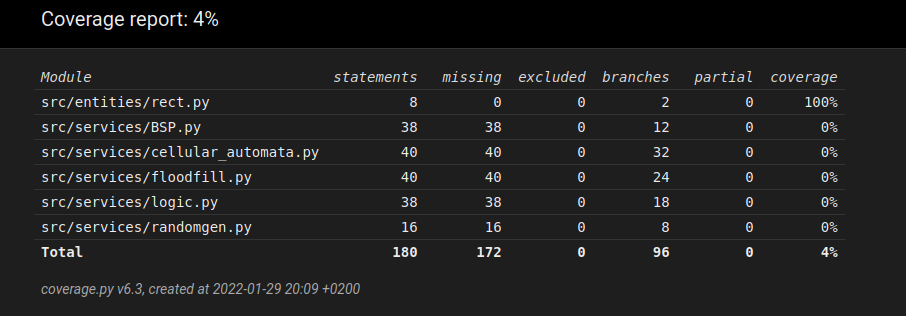

# Weekly report 
## Week 2

Coding started! Wrote simple text UI and working, but unrefined versions of all algorithms (except the one responsible for digging tunnels). Program logic consists of one method, that is made mainly to test that the algorithms work together and they do. The Program prints a 200x50 map to the console. User defined setup is not implemented yet. Algorithm parameters need more work still, especially cellular automata. The look of the dungeon is not quite what i had in mind yet, but that will be remedied when I find the right combination of parameters. I also wrote a crude but working generator for random numbers. It simply takes boundaries as input, calls time_ns, takes last digits (number of digits taken depends of the upperbound given) and if they are inside the boundary returns them. 

Concentrated on coding this week. Refined the ReadMe to be bit more usefull, but apart from that, no further progress on documentation made. Program should be at a state that allows me to focus a bit more on that side of the project next week. Code is of course commented at the same time it is written.

Configured Poetry for ease of use, added also, Pylint, Pytest and coverage. Wrote first few tests, but the test coverage is not very satisfactoy (4%). Part of next weeks plan is to raise it to acceptable level. Same goes for Pylint precentage. Image of coverage report can been seen at the bottom of this document.

Start the program by running launch.py, commands implemented this far are Q for quit and C for creating new map (not case sensitive) 

Algorithms writen:

Binary space partitioning (BSP)

cellular automata

flood fill

# Hours used:

 week | hours | recap
 ---- | ----- | -----
  1 | 10 | planning, research, setting up
  2 | 16 | planning, coding, tweaking, setting up (poetry, pylint, coverage, pytest), wrote first tests
Total : 26

