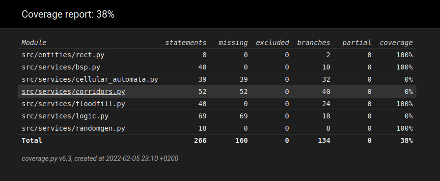

# Weekly report 
## Week 3

Coding continues! Wrote a quick messy class for digging the corridors. It is not beautiful and digs only straight horizontal and straight vertical corridors, but it works and digs from were I want to where I want. I mean to rewrite it later, I would like it more if it dug in more organic manner. I also wrote a params class to store all of the parameters for the algorithms in more centered manner and refactored everything to use it. Later on I will implement a way to modify them while the program is running. Refactored the logic class to a make more sense and be readable (and testable).

Corrected formatting to better adhere the standards of pylint. Pylint score is currently 9.26/10. I modified the standards a bit, because I really think that x, and y are self explanatory and reasonable variable names when dealing with 2D arrays. 

Wrote a bunch of tests, test coverage is 100% for all of the tested classes. Tests are still missing from logic, cellular automata, and corridors classes. The random number generator is not tested for the truly random distribution of numbers. I did not feel like it was worth of the effort, when using such a elementary and well researched way of generating them. 

Spent a quite a while generating maps and changing parameters, and generally marveling the beauty of my creation.

Image of coverage report can been seen at the bottom of this document.

Start the program by running launch.py, commands implemented this far are Q for quit and C for creating new map (not case sensitive) 

Algorithms writen:

Binary space partitioning (BSP)

cellular automata

flood fill

### QUESTION: 
The program is not really using any premade or very complex datastructures. I have used basic python list for everything. Should I try to change that so that I would have something to satisfy the "Implementing own datasructures" part of the assignment? I presume that I am not intended to rewrite basic list. I could maybe use deque in the floodfill algorithm so that I could get the "popleft" functionality. Now I just do the same thing with list using x = list[-1] and  remove(list[-1]). If the program is fine as it is, regarding this topic, I'm more than happy to not complicate it, but also want it to fulfill the assignment. 

# Hours used:

 week | hours | recap
 ---- | ----- | -----
  1 | 10 | planning, research, setting up
  2 | 16 | planning, coding, tweaking, setting up (poetry, pylint, coverage, pytest), wrote first tests
  3 | 18 | coding, refactoring, styling (pylint), writing tests, testing parameters	
Total : 44

