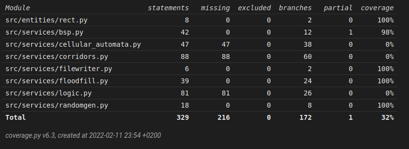

# Weekly report 
## Week 4

Wrote part of the program that lets user change settings while program is running and a filewriter class. If output to file is enabled in settings, the program will output the current parameters and the map generated to a .txt file. By default the file name is derived from current date in format yyyy-mm-dd.txt and default location is in ./data folder. Both the name and the location can be changed in the settings.

Currently the settings view will give the user limits for the parameters, if there are some to consider, but they are not enforced. It is possible and even quite easy to get the program to critacally fail, or get stuck in an infinite loop if parameters are set against the limits. Enforcing is on its way but did not get ready this week.

I did a bit refactoring in the messy class that carves corridors between rooms, now it they are slightly more organic looking, but I'm not quite satisfied with them yet. There also was a bug where the program was sometimes unable to find a floor spot for one end of a corridor, which caused an infinite loop. While isolating and debugging it I noticed a bug in BSP algorithm, I had even mirrored it in the tests. The algorithm would keep partitioning untill both constrains were met. One of these days I will learn a lesson about writing tests while I should be already sleeping. I spent annoying amount of time on that whole mess that was suposed to be just a quick refactor of a small class.

Started to write Implementation and testing reports. Did not get very far with them, but its a start!

Wrote test to test the filewriter class, and refactored old tests as needed other than that test coverage is approx same than last weeks, 32% .
Pylint score 9.38/10

# Hours used:

 week | hours | recap
 ---- | ----- | -----
  1 | 10 | planning, research, setting up
  2 | 16 | planning, coding, tweaking, setting up (poetry, pylint, coverage, pytest), wrote first tests
  3 | 18 | coding, refactoring, styling (pylint), writing tests, testing parameters	
  4 | 16 | coding, testing, preparing documentation, bug hunting

Total : 60

