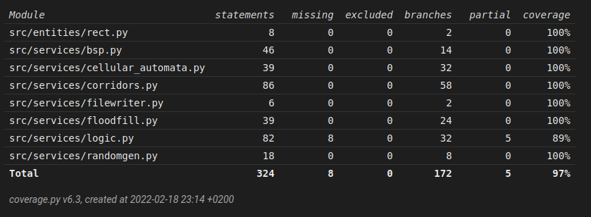

# Weekly report 
## Week 5

This week I consentrated more on testing and documentation than refactoring or implementing more features. I added constrains on runtime settings view so that the user is mostly unable to crash the program by giving conflicting parameters to the different parts. Giving invalid path for filewriter is permitted, but will prevent map generation. I did some slight prettying here and there and rewrote something hera and there, but for most part the functionality of the program starts to satisfy me. That ofcourse means that I might have time to adres parts of the program that I'm not completely satisfied with on the following weeks. However for next week my plan is to focus on testing still.

I wrote first proper versions of the implemention and testing reports. Implemention report is at least near its final form, unless I get some negative feedback on it or decide to make some bigger changes on the program. Started to think about writing the user manual, but it never really progressed beoynd the level of thought. The testing report is due to go thtough changes, when I have devoted more time for the actual testing.

The first code review took some of the time allocated for this course this week. It was nice seeing another approach for similar project. Even if our goals are guite different. I even started to think about implementing Prims's algorithm for the corriddors, but probably it is beter not to start that at this point of the course. I still hope that I'll have time to do something to make them more visually appealing, but we'll see if that happens or not.

I wrote unittests for the classes that I had left without attention earlier. The branch coverage is now at much more satisfying level 97%. The missing three procent are in logic class and for most part temporary error handling solutions that I will replace with better ones eventually.

Pylint score 9.54/10

# Hours used:

 week | hours | recap
 ---- | ----- | -----
  1 | 10 | planning, research, setting up
  2 | 16 | planning, coding, tweaking, setting up (poetry, pylint, coverage, pytest), wrote first tests
  3 | 18 | coding, refactoring, styling (pylint), writing tests, testing parameters	
  4 | 16 | coding, testing, preparing documentation, bug hunting
  5 | 16 | coding, testing, writing documentation, code review 
Total : 76

