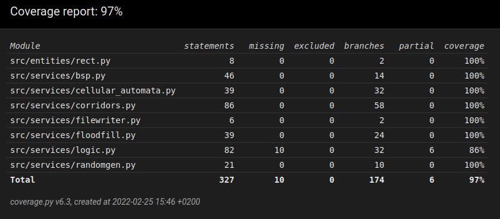

# Weekly report 
## Week 6

This week I Tried to concentrate on performance testing. I got a bit sidetracked after the last weeks code reviewer was unable to run the program. I found out that windows and linux handle system_ns differently and that made my RNG to generate only zeroes on windows machines. After some headscratching I managed to figure out a way to make things better in that regard and my RNG is now much better. Besides that no thing was changed in the program code (I think). Some minor tweaking of the default parameters and fixed some small bugs.

I wrote a separate class for the performance tests. I'm bit unsure of what is a acceptable scope of performance testing and testing generally for this course. Right now I have the unittests and the performance test. I plan on leaving them as they are now. Besides that I plan to manually test running program with different settings and observe the output, to get a overall sense of how different settings change the outcome of the program. Does that sound like solid enough testing plan, or should I do something differently?

Besides the prformance tests, in the same class I tested the distribution of numbers generated by my RNG vs python randrange. I noticed that it was stisfactory and that brought me joy.

I also ofcourse made the second code review

If the testing is at ok level for the last week I will concentrate on writing the manual, doing the behaviour testing and polishing the code, there are still some temporary solutions here and there that should be finally taken care of. 

Coverage is at the same level as last week 97%
Pylint score 9.52/10

# Hours used:

 week | hours | recap
 ---- | ----- | -----
  1 | 10 | planning, research, setting up
  2 | 16 | planning, coding, tweaking, setting up (poetry, pylint, coverage, pytest), wrote first tests
  3 | 18 | coding, refactoring, styling (pylint), writing tests, testing parameters	
  4 | 16 | coding, testing, preparing documentation, bug hunting
  5 | 16 | coding, testing, writing documentation, code review
  6 | 12 | debugging, testing, performance testing, writing documentation, code review 
Total : 88

